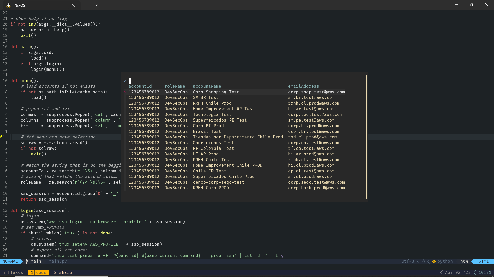

# AWS SSO login with fzf

```
$ nix run "github:rivera-bl/flakes?dir=fws"

usage: main [-h] [-o] [-l]

AWS SSO login with fzf

options:
  -h, --help   show this help message and exit
  -o, --load   Cargar cuentas en /tmp/fws/accounts.csv y sso.sessions en ~/.aws/config
  -l, --login  Despliega `fzf` para seleccionar cuenta con la que iniciar sesión en AWS SSO.
               Si es primera vez que se ejecuta el comando, entonces va ejecutar
               automaticamente la función de --load, para obtener la lista de cuentas
```




`nix run --refresh "github:rivera-bl/flakes?dir=fws" -- --login`
